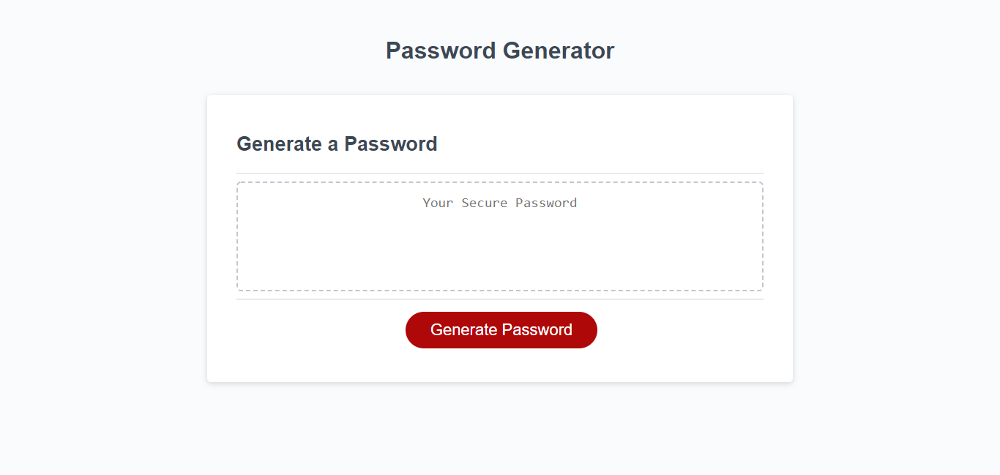

# Module03-Challenge

## Table of Contents

## Table of Contents
1. [Description](#description) 
2. [Usage](#description)
3. [Visuals](#visuals)
4. [Resources](#resources)


## Description

JavaScrypt file was modified to allow an application to generate random passwords based on criteria outlined in the file.


## Usage

- User was giving the choice of characters that are allowed in the password to be generated.
  Teacher instructed with the start of the function

```js
function generatePassword() {
  var password = '';

  var lowercase = "abcdefghijklmnopqrstuvwxyz";
  var numbers = "0123456789";
  var special = "#$%&()*+,-./:;<=>?";
  var uppercase = lowercase.toUpperCase(); 
```

- In line 14 a new var was added to call the concatenation of all possible characters

```js
 // Added a new var to concat strings above
  var allCharacters = '';
```

- A while loop was created to give user the choice of lenght of characters.
An alert was set for users who do not chose an allowed number of characters.

```js
    alert('Password must be between 8 and 128 characters long');
```

- Another while loop was create to make sure user chooses at least one type of character.
```js
while (wantsLower === false && wantsNumbers === false && wantsSpecial === false && wantsUpper === false) {
    alert("Please choose at least one character type");
    generatePassword();
  }
```

- For loop was added to match the number of characters chosen to the lenght of the password being generated.

```js
  for (var i = 0; i < inputLength; i++) {
    password += allCharacters.charAt(Math.floor(Math.random() * allCharacters.length))
  }
```


## Visuals



## Resources
- [Repository](https://github.com/alicessilva22/module03-challenge)
- [Live Site](https://alicessilva22.github.io/Password-Generator/)